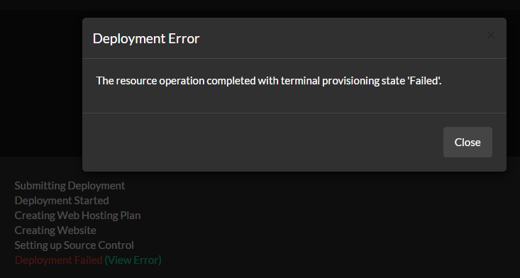
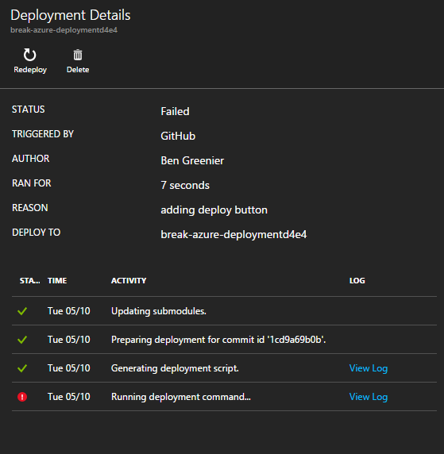
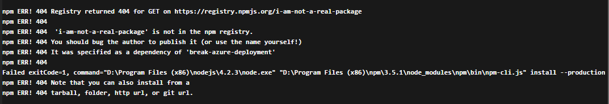

# Why?

This will fail to deploy since there is a dependency specified that does not exist.

You'll see the following error on deploy.azure.com:

Which is a result of the failure on portal.azure.com:

Which is a result of the npm install failure:

